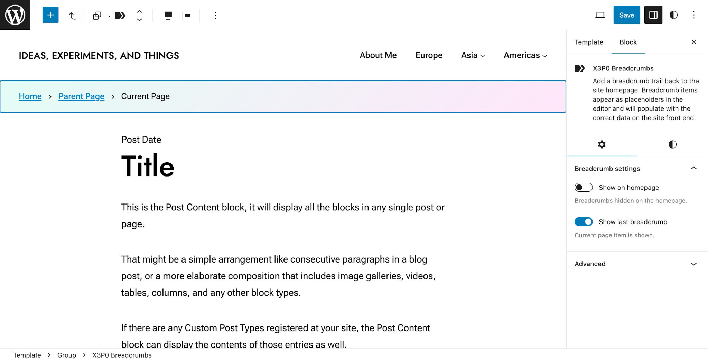

# X3P0: Breadcrumbs

A breadcrumbs block for WordPress.



## Breadcrumbs Reimagined for a Modern, Block-Based WordPress

In 2009, I [launched the first version of this script](https://justintadlock.com/archives/2009/04/05/breadcrumb-trail-wordpress-plugin) as a WordPress plugin. And I've continually refined it ever since.

Today, this plugin exists as a WordPress block, all built upon a solid OOP foundation that's more powerful than ever. The block is the easy-to-use version that regular, everyday WordPress users can simply plug into their site and go about their business. But the stuff under the hood gives developers an insane amount of control to customize breadcrumbs to suit their needs.

## Usage

### From the Editor

You can add the the **Breadcrumbs** block via the block inserter in the editor anywhere. This can include post, pages, templates, parts, and patterns. Just insert it and configure the settings however you like. Preferably, you'd add it to something like your **Header** template part so that it gets reused across the site.

### Block Themes

If you're a block theme author, you can include support for the Breadcrumbs block in your theme by adding the following block markup to a template, part, or pattern:

```html
<!-- wp:x3p0/breadcrumbs /-->
```

That will output the block with the defaults. Of course, you can configure it by customizing the attributes available for the block. Here is an example that changes the `separator` attribute to show an arrow:

```html
<!-- wp:x3p0/breadcrumbs {"separator":"arrow"} /-->
```

## Developers

### Outputting Breadcrumbs With PHP

The plugin isn't just a simple block. The plugin's foundation is actually a robust, object-oriented script for generating breadcrumbs for pretty much anything you throw at it.

This foundation includes three primary interfaces:

- [`X3P0\Breadcrumbs\Contracts\Environment`](https://github.com/x3p0-dev/x3p0-breadcrumbs/blob/master/src/Contracts/Environment.php): Defines the query, builder, and crumb classes that are used for generating breadcrumbs.
- [`X3P0\Breadcrumbs\Contracts\Breadcrumbs`](https://github.com/x3p0-dev/x3p0-breadcrumbs/blob/master/src/Contracts/Breadcrumbs.php): Generates the breadcrumb items ("crumbs").
- [`X3P0\Breadcrumbs\Contracts\Markup`](https://github.com/x3p0-dev/x3p0-breadcrumbs/blob/master/src/Contracts/Markup.php): Renders the markup for a breadcrumb trail.

By default, the plugin includes one implementation for both the `Environment` and `Breadcrumbs` interfaces. It includes three implementations of the `Markup` interface for outputting plain HTML, microdata-formatted, and RDFa-formatted lists.

```php
use X3P0\Breadcrumbs\Breadcrumbs;
use X3P0\Breadcrumbs\Environment\Environment;
use X3P0\Breadcrumbs\Markup\Html;

$environment = new Environment();
$breadcrumbs = new Breadcrumbs($environment);
$markup      = new Html($breadcrumbs);

echo $markup->render();
```

Or, if you wanted, you could shorten that to:

```php
use X3P0\Breadcrumbs\Breadcrumbs;
use X3P0\Breadcrumbs\Environment\Environment;
use X3P0\Breadcrumbs\Markup\Html;

(new Html(new Breadcrumbs(new Environment())))->render();
```

### Markup Implementations

The plugin comes with three classes, which are implementations of the `X3P0\Breadcrumbs\Contracts\Markup` interface, for rending the final HTML of the breadcrumb trail.

- `X3P0\Breadcrumbs\Markup\Html`: Renders a plain HTML list of breadcrumbs.
- `X3P0\Breadcrumbs\Markup\Microdata`: Renders an HTML list of breadcrumbs using Schema.org microdata.
- `X3P0\Breadcrumbs\Markup\Rdfa`: Renders an RDFa (Resource Description Framework in Attributes) compliant HTML list of breadcrumbs.

Here's an example of swapping out the `Html` implementation shown earlier with the `RDFa` implementation:

```php
use X3P0\Breadcrumbs\Breadcrumbs;
use X3P0\Breadcrumbs\Environment\Environment;
use X3P0\Breadcrumbs\Markup\Rdfa;

$environment = new Environment();
$breadcrumbs = new Breadcrumbs($environment);
$markup      = new Rdfa($breadcrumbs);

echo $markup->render();
```

You are, of course, free to build your own implementation too. Any class that implements the `X3P0\Breadcrumbs\Contracts\Markup` interface will work.

### Markup Options

The `Html`, `Microdata`, and `Rdfa` classes, each of which are implementations of the `Markup` interface, accept two parameters:

- **`breadcrumbs`:** An implementation of the `X3P0\Breadcrumbs\Contracts\Breadcrumbs` interface.
- **`options`:** A configurable array of options for customizing how the markup is generated:
	- **`show_on_front`:** Whether to show the breadcrumbs on the site front page. Defaults to `false`.
	- **`show_trail_end`:** Whether to display the final breadcrumb item (usually the current page). Defaults to `true`.
	- **`before`:** Custom HTML to add before the HTML output. Defaults to an empty string.
	- **`after`:** Custom HTML to add after the HTML output. Defaults to an empty string.
	- **`container_tag`:** The HTML tag used for the wrapping container. Defaults to `nav`. If this is set to an empty string, the container will not be output.
	- **`title_tag`:** The HTML tag used for the Breadcrumbs heading element. Defaults to `h2`. If this is set to an empty string, no heading will be output.
	- **`list_tag`:** The HTML tag used for the breadcrumbs list. Defaults to `ol`.
	- **`item_tag`:** The HTML tag used to wrap each breadcrumb. Defaults to `li`.
	- **`container_class`:** The class used for the container element. Defaults to `breadcrumbs`.
	- **`title_class`:** The class used for the title/heading element. Defaults to `breadcrumbs__title`.
	- **`list_class`:** The class used for the list element. Defaults to `breadcrumbs__trail`.
	- **`item_class`:** The class used for each breadcrumb item. Defaults to `breadcrumbs__crumb`.
	- **`item_content_class`:** The class used for the `<a>` or `<span>` element wrapping the breadcrumb inner content. Defaults to `breadcrumbs__crumb-content`.
	- **`item_label_class`:** The class used for the inner `<span>` element that wraps the breadcrumb label. Defaults to `breadcrumbs__crumb-label`.

Here is an example of using Schema.org microdata (via the `Microdata` class) and configuring the container and title output:

```php
use X3P0\Breadcrumbs\Breadcrumbs;
use X3P0\Breadcrumbs\Environment\Environment;
use X3P0\Breadcrumbs\Markup\Microdata;

$markup_options = [
	'container_tag' => 'div',
	'title_tag'     => ''    // Will remove title.
];

$environment = new Environment();
$breadcrumbs = new Breadcrumbs($environment);
$markup      = new Microdata($breadcrumbs, $markup_options);

echo $markup->render();
```

These options are also configurable via the `x3p0/breadcrumbs/markup/config` filter hook:

```php
add_filter('x3p0/breadcrumbs/markup/config', fn(array $options) => $options);
```

### Breadcrumb Options

The `Breadcrumbs` class accepts two parameters:

- **`environment`:** An implementation of the `X3P0\Breadcrumbs\Contracts\Environment` interface.
- **`options`:** A configurable array of options for customizing how the breadcrumbs are generated:
	- **`network`:** Whether to show the network as part of the breadcrumb trail on multisite installations. Defaults to `false`.
	- **`post_rewrite_tags:`** Whether to generate breadcrumbs based on the WordPress `post` post type's rewrite tags (e.g., `%year%`, `%monthnum%`, etc.). Defaults to `true`.
	- **`show_home_label`:** Whether to display the Homepage label. Defaults to `true`. Disabling this will hide the label but not the crumb itself. It's generally meant to be used when replacing the label with an icon via CSS.
	- **`labels`:** An array of internationalized crumb labels that can be customized:
		- `title`: `Browse:`
		- `aria_label`: `Breadcrumbs`
		- `home`: `Home`
		- `error_404`: `404 Not Found`
		- `archives`: `Archives`
		- `search`: `Search results for: %s`
		- `paged`: `Page %s`
		- `paged_comments`: `Comment Page %s`
		- `archive_minute`: `Minute %s`
		- `archive_week`: `Week %s`
		- `archive_minute_hour`: `%s`
		- `archive_hour`: `%s`
		- `archive_day`: `%s`
		- `archive_month`: `%s`
		- `archive_year`: `%s`
	- **`post_taxonomy`:** An array of post types and which taxonomy to use in the breadcrumb trail for single posts. The array key must be a valid post type name (e.g., `post`, `book`), and the array value must be a valid taxonomy name (e.g., `category`, `genre`). By default, this is an empty array.

Here is an example of disabling post rewrite tags and enabling the category taxonomy for single posts:

```php
use X3P0\Breadcrumbs\Breadcrumbs;
use X3P0\Breadcrumbs\Environment\Environment;
use X3P0\Breadcrumbs\Markup\Html;

$breadcrumb_options = [
	'post_rewrite_tags' => false
	'post_taxonomy' => [
		'post' => 'category'
	]
];

$environment = new Environment();
$breadcrumbs = new Breadcrumbs($environment, $breadcrumb_options);
$markup      = new Html($breadcrumbs);

echo $markup->render();
```

These options are also configurable via the `x3p0/breadcrumbs/config` filter hook:

```php
add_filter('x3p0/breadcrumbs/config', fn(array $options) => $options);
```

## License

X3P0 Breadcrumbs is licensed under the GPL version 3.0 or later.

The project includes resources from [Material Icons](https://fonts.google.com/icons), which are licensed under [Apache 2.0](http://www.apache.org/licenses/LICENSE-2.0.txt).
